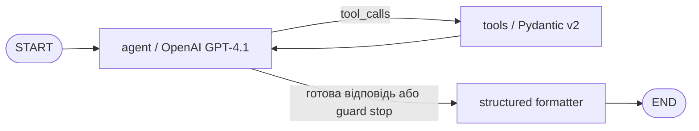

# ADD_HW_01_Kukharenko

## Практична мета

Агент визначає, чи обґрунтований залишок матеріалу, де є надлишок або нестача даних, і готує наступну дію. Він зіставляє залишок, ремонтний попит, історичне споживання та відкриті закупівлі. Дані синтетичні, але структура відповідає типовому експорту з ERP; комерційні дані не входять до роботи.

## Архітектура



`react_agent.py` містить `StateGraph`, вузли `agent` і `tools`, conditional edge та structured output `AgentResponse`. `ModelPort` дозволяє тестувати граф без мережі, а `OpenAIModel` використовує `bind_tools()` і `with_structured_output()`.

## Інструменти

| Tool | Призначення |
|---|---|
| `get_stock_balance` | Фактичний залишок, попит і закупівля |
| `calculate_stock_status` | Обґрунтований рівень, надлишок і заморожена вартість |
| `find_transfer_options` | Дефіцит на інших підприємствах |
| `build_reduction_proposal` | Чернетка дії без проведення в ERP |

Кожний tool має окрему Pydantic v2 schema з `Field(description=...)`, `field_validator` і docstring для LLM. Некоректні коди, майданчики, горизонти та кількості відхиляються до бізнес-логіки.

## Захисні механізми

- `max_steps` зупиняє граф із частковим результатом;
- загальний deadline і timeout OpenAI-запиту обмежують час;
- три однакові послідовні tool calls означають цикл;
- trajectory пишеться атомарно у JSON;
- жодний tool не змінює ERP: у HW2 агент лише радить.

## Запуск у WSL Ubuntu 24.04

```bash
cd /path/to/ADD_HW_01_Kukharenko
uv venv /tmp/ADD_HW_01_Kukharenko-venv --python 3.12
source /tmp/ADD_HW_01_Kukharenko-venv/bin/activate
uv pip install -r requirements.txt
pytest -q
python run_demo.py
python run_demo.py --live --env-file /path/to/private/.env.local "Оціни BRG-6205 на PLANT-A і запропонуй переміщення"
```

Ключ не включено. Модель за замовчуванням — `gpt-4.1`, яка підтримує function calling і structured outputs.

## Результати

`test_results.json` містить 5 сценаріїв із запитом, очікуванням, фактичним результатом, кроками, tools і часом. `trajectory.json` — повний лог репрезентативного сценарію; окремі траєкторії лежать у `artifacts/trajectories/`.

Сильна сторона рішення — арифметика й правила виконуються кодом. Обмеження — fixture не містить lead time, взаємозамінності та підтвердженої ймовірності аварії. Тому категорія `uncertain` є нормальною відповіддю, а не ввічливою формою паніки.
