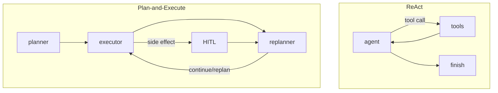

# Практичне завдання №1 — агентна система ремонтних запасів

Це повний навчальний полігон для прикладної задачі: виявити необґрунтовані ремонтні запаси, не знищивши аварійний резерв і здоровий глузд.До кінця року буде реальна спроба впровадження в польових умувах.

## Реалізовано

- 4 tools із Pydantic v2 schemas, `Field`, `field_validator` і JSON envelope `{status, data/error}`;
- ReAct-граф `agent → tools → agent`;
- `max_steps=10`, `timeout=120`, детекція трьох повторів, JSON trajectory;
- Plan-and-Execute `planner → executor → replanner` із `Plan` та `ReplanDecision`;
- файловий `SqliteSaver`, `get_state()`, перезапуск runtime і продовження того самого `thread_id`;
- Agentic RAG: ChromaDB з 10 документами та `search_knowledge`;
- HITL `interrupt()` / `Command(resume=...)` для `commit_reduction_action`;
- pytest: 5 негативних schema-тестів, tools, ReAct, fallback, Plan-and-Execute;
- бонуси: числове порівняння архітектур, Mermaid і fallback.

## Архітектури



ReAct компактніший і природний для короткої діагностики. Plan-and-Execute дає явний план, checkpoints та кращий контроль багатокрокового скорочення. Для production я обрав би Plan-and-Execute для дій, а ReAct — для read-only розвідки.

## Файли доказів

- `trajectory.json` — повна ReAct-траєкторія з node/action/observation/tool calls;
- `agent_state.db` — checkpoints LangGraph;
- `chroma_db/` — persistent collection з 10 документами;
- `agent_comparison.json` — однаковий запит, час, кроки й tools;
- `persistence_demo.json` — збережений step/next і результат відновлення;
- `hitl_demo.json` — фактичні сценарії `approve`, `reject`, `edit` після перезапуску runtime;
- `graph.mmd` — Mermaid, отриманий через `draw_mermaid()`;
- `test_results.txt` — фактичний вивід pytest.

## Запуск

```bash
cd /path/to/Task_001_Arthur
source /tmp/arthur-course-venv/bin/activate
pytest -q
python run_practice.py
```

Live-модель підключається класом `LiveReActModel` (`gpt-4.1`); ключ передається лише з приватного env-файлу і не зберігається у проєкті.

